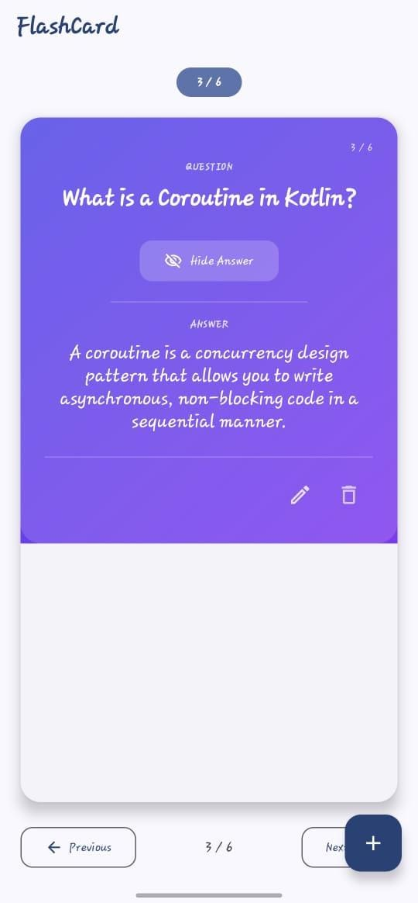
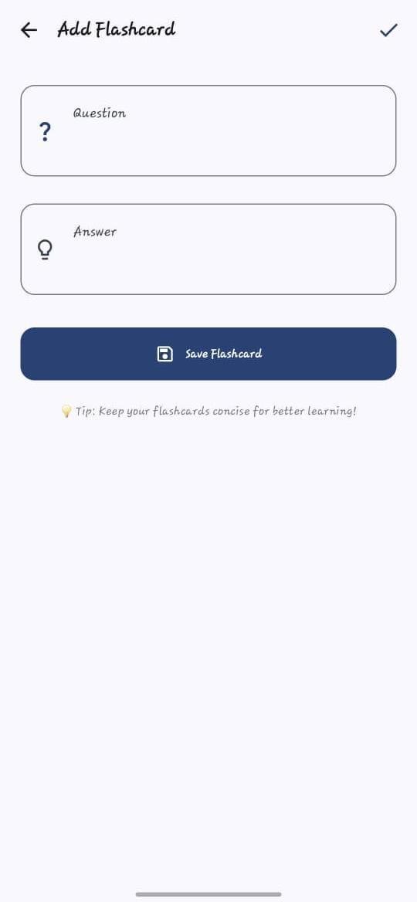

# 📚 FlashCard Quiz App

A modern **FlashCard Quiz Android application** built with **Kotlin** and **Jetpack Compose** to help users study efficiently. Users can create, edit, delete, and review flashcards with a clean **Material 3** interface.

---

## ✨ Features

- 📖 View one flashcard at a time
- 👀 Show / Hide Answer
- ⬅️➡️ Navigate between flashcards
- ➕ Add new flashcards
- ✏️ Edit existing flashcards
- 🗑️ Delete flashcards
- 💾 Store flashcards locally using Room Database
- 🎨 Modern Material 3 UI
- 📱 Responsive Jetpack Compose interface
- 🏗️ MVVM Architecture

---

## 🛠️ Tech Stack

- Kotlin
- Jetpack Compose
- Material 3
- Room Database
- MVVM Architecture
- Navigation Compose
- Hilt (Dependency Injection)
- Coroutines
- StateFlow

---

## 📸 Screenshots

| Home Screen | Add Flashcard |
|-------------|---------------|
|  |  |

> **Note:** Replace these images with your own screenshots by creating a `screenshots` folder in your repository.

---

## 🚀 Getting Started

1. Clone the repository.

```bash
git clone https://github.com/your-username/FlashCard.git
```

2. Open the project in **Android Studio**.
3. Sync Gradle.
4. Run the application on an emulator or Android device.

---

## 📂 Project Structure

```
app/
├── data/
├── domain/
├── di/
├── presentation/
├── navigation/
└── ui/
```

---

## 🎯 Learning Objectives

This project demonstrates:

- Android development using Jetpack Compose
- Local data storage with Room Database
- MVVM Architecture
- State Management
- CRUD Operations
- Modern Material 3 UI Design

---

## 🤝 Contributing

Contributions are welcome! Feel free to fork this repository and submit a pull request

---
